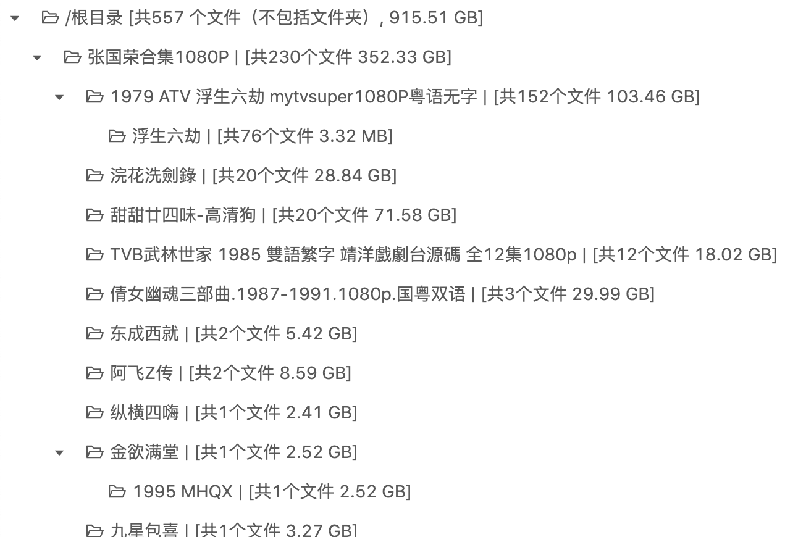
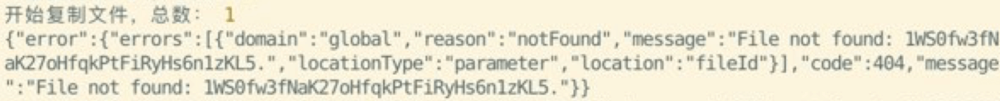

## 更新日志
> 更新方法：在 gd-utils 目錄下，執行 `git pull` 拉取最新代碼，如果你使用了 pm2 守護進程，執行`pm2 reload server`刷新生效。

### [2020-08-28]
- 如果統計表格長度超出telegram消息限制，只顯示前20行記錄（之前是顯示概要）
- 當用機器人統計目錄數比較多的鏈接時，10秒後返回進度詳情，且之後每隔10秒更新一次進度信息。

### [2020-08-13]
- 給命令行 `./count` 添加 [snap2html](https://github.com/rlv-dan/Snap2HTML) 的導出方式，示例用法：
```bash
./count folderID -S -t snap -o example.html
```
導出html示例：[example.html](https://code.viegg.com/single/snap2html-example.html)
源文件夾鏈接：[999](https://drive.google.com/drive/folders/1A35MT6auEHASo3egpZ3VINMOwvA47cJG)

### [2020-08-08]
- 給機器人添加 `/reload` 指令，表示重啟進程，中斷所有進行中的任務(前提是進程由pm2守護)

### [2020-08-06]
- 由於最近`userRateLimitExceeded`的錯誤越來越頻繁出現，看上去Google除了每日750G以外又加上了什麽限制。我只好把剔除SA的條件從“連續2次”遇到這種報錯消息改成了**連續7次**……這個值也可以自定義，只需要在`config.js`中導出一個 `EXCEED_LIMIT`的變量，具體方法請參考[專家設置](https://github.com/iwestlin/gd-utils/blob/master/readme.md#%E4%B8%93%E5%AE%B6%E8%AE%BE%E7%BD%AE)

- 另外為了用戶體驗還隱去了包含`rate limit`的報錯信息，同時將重置SA（也就是重新啟用被剔除的SA）改成了每2小時執行一次（原來是12小時）

### [2020-08-05]
- 配合[gdshare](https://github.com/iwestlin/gdshare)使用，給 [aria2.js](./aria2.js) 添加 `--hashkey` `--cf` `--expire` 選項，具體含義請執行 `./aria2.js -h` 查看。  
使用示例：
```bash
./aria2.js folderID -k 'your hashkey' -c 'your.domain.com' -S
```
這條命令會在當前目錄生成一個包含所有文件下載鏈接的文本文件並輸出一條以 `aria2c` 開頭的命令，執行這條命令即可調用[aria2c](https://aria2.github.io/)下載整個`folderID`目錄，並保留目錄結構。

### [2020-08-02] 關於“沒有可用的SA”報錯信息
- 最近Google Drive的 API 似乎有點抽風，轉存新分享的資源時經常隨機遇到`userRateLimitExceeded`（一般這種錯誤只會在SA用完每日轉存流量750G時觸发）的接口返回錯誤導致SA被剔除（即使是新加的SA也會遇到），而對於比較老的分享或者自己團隊盤文件對拷則沒問題。  
不得已我只好修改了一下程序的邏輯，只有當SA連續兩次遇到`userRateLimitExceeded`的錯誤時才會被剔除，在這種條件下，據我的觀察，拷貝一個新分享的資源時，平均每轉存100個文件會被剔除掉一個SA。  
如果你不希望因為接口返回`userRateLimitExceeded`而剔除掉對應的SA，可以手動修改代碼，方法見：https://github.com/iwestlin/gd-utils/issues/138#issuecomment-666156273
- 命令行添加 `--dncf` 參數，表示`do not copy folders`，即轉存資源時不覆制任何遞歸子目錄，直接將所有文件拷貝到新生成的文件夾中。

[2020-07-28]  
- 添加 [aria2.js](https://github.com/iwestlin/gd-utils/blob/master/aria2.js) 腳本，方便利用 `aria2c` 下載google drive目錄，使用幫助可執行 `./aria2.js -h` 查看。

相關 issue: [https://github.com/iwestlin/gd-utils/issues/133](https://github.com/iwestlin/gd-utils/issues/133)  
使用錄屏：[https://drive.google.com/file/d/1lzN7R9Klw66C5UttUUDN3_EsN3pNs62q/view](https://drive.google.com/file/d/1lzN7R9Klw66C5UttUUDN3_EsN3pNs62q/view)

[2020-07-21]  
- 添加數據庫clear腳本，只需在`gd-utils`目錄下執行`node clear-db.js`就可以刪除所有獲取的文件信息（但會保留拷貝記錄和bookmark）同時減小數據庫文件大小了
- 調整提取分享鏈接的方法，基本能夠識別所有類型消息中的分享ID

[2020-07-17]  
- 給命令行 `./dedupe` 添加 `--yes` （簡寫`-y`）選項，表示“若发現重覆項，不詢問直接刪除”
- 給 `./copy` `./count` `./dedupe` 添加 `--sa` 選項，可指定sa目錄位置  
示例用法 `./count folderID -S --sa test`，表示讀取 `./test` 目錄下的sa json文件（而不是默認的./sa目錄）

[2020-07-15]  
- 給tg機器人添加「強制刷新」和「清除按鈕」按鈕。  
點擊「強制刷新」可以無視本地緩存強制從線上獲取對應鏈接的文件信息，省去手動輸入 `/count folderID -u` 的麻煩  
點擊「清除按鈕」可以清除鏈接消息下的多個按鈕，適合任務完成後清除，防止誤觸

[2020-07-11]  
- 給tg機器人添加單文件鏈接（`https://drive.google.com/file/d/1gfR...`）轉存功能

[2020-07-10]  
- 添加樹形導出類型，示例用法： `./count folder-id -S -t tree -o tree.html`

[tree.html](https://gdurl.viegg.com/api/gdrive/count?fid=1A35MT6auEHASo3egpZ3VINMOwvA47cJG&type=tree)可直接用瀏覽器打開：


前端源碼：[https://github.com/iwestlin/foldertree/blob/master/app.jsx](https://github.com/iwestlin/foldertree/blob/master/app.jsx)

[2020-07-08]
- 添加[colab腳本](https://github.com/iwestlin/gd-utils/issues/50#issuecomment-655298073)

[2020-07-07]
- 在覆制文件時不使用p-limit依賴，改為while循環控制並行請求數，從而大大減少覆制十萬及以上數量級文件時的內存占用，避免進程被node強行退出。
- 給機器人添加更多 /task 功能，支持清除所有已完成任務、刪除特定任務

[2020-07-06]  
- 給機器人添加收藏功能，[使用示例](https://drive.google.com/drive/folders/1sW8blrDT8o7882VOpXXr3pzXR73d4yGX)

[2020-07-05]  
- pm2 啟動腳本換成 `pm2 start server.js --node-args="--max-old-space-size=4096"`，避免任務文件數超大時內存占用太高被node幹掉。

[2020-07-04]**【重要更新】**  
- 解決了長時間拷貝命令突然出現 `Invalid Credentials` 錯誤的問題。
原因是依賴的[gtoken](https://www.npmjs.com/package/gtoken)在過期時間後並不返回新的access_token...之前有不少朋友遇到過，一開始我還以為是sa同時使用太多觸发了Google限制，直到我自己將sa分批使用量降到了50卻也依然遇到了這種報錯……
- 提升了拷貝大量文件時數據庫的操作效率，大大減少了cpu占用。(由於更改了數據庫的結構，所以如果有未完成的任務，請先跑完任務再更新。如果更新代碼後再繼續之前未完成的任務，會導致無法接上進度。)
- 如果觸发團隊盤40萬文件數限制，會返回明確的錯誤消息，而不是之前的 `創建目錄失敗，請檢查您的賬號是否有相關權限`
- 如果創建目錄未完成被中斷，相同命令重新開始執行後，會保留原始目錄的結構繼續創建目錄。（之前會導致結構被打亂）

[2020-07-03]  
- 給命令行 ./copy 命令添加了 `-D` 選項，表示不在目的地創建同名文件夾，直接將源文件夾中的文件原樣覆制到目的文件夾中

[2020-07-02]  
- 機器人 /task 命令返回的進度信息每 10 秒更新一次
- `./dedupe` 改為將重覆文件移動到回收站（需要內容管理者及以上權限）
- 給 sqlite 打開 WAL 模式提升效率
- 提前5分鐘將access_token判定為過期，減少未授權錯誤

[2020-07-01]（建議所有使用tg機器人的用戶更新）  
- 給機器人的 `/count` 和 `/copy` 命令添加了 `-u` 參數的支持，命令最後加上 -u 表示強制從線上獲取源文件夾信息
- 允許繼續狀態為已完成的任務（適合搭配 -u 參數，增量覆制剛分享出來的未更新完畢的文件夾）
- 支持識別轉发的 [@gdurl](https://t.me/s/gdurl) 頻道消息中的google drive鏈接
- 機器人回覆任務完成消息時，攜帶 `成功拷貝目錄（文件）數/總目錄（文件）數`
- 機器人回覆統計消息時，攜帶文件夾名稱
- 機器人回覆`/task`消息時，攜帶源文件夾名稱鏈接和新文件夾鏈接
- 當統計表格太長導致機器人发送消息失敗時，发送統計概要
- 增加了 [專家設置](#專家設置) 一節，保障HTTPS接口安全

[2020-06-30]  
- 命令行操作時，不換行輸出進度信息，同時將進度信息輸出間隔調整為1秒
- 隱藏 timeout exceed 報錯信息

## 重要更新（2020-06-29）
如果你遇到了以下幾種問題，請務必閱讀此節：

- 任務異常中斷
- 命令行日志無限循環輸出但進度不變
- 覆制完发現丟文件

有不少網友遇到這些問題，但是作者一直無法覆現，直到有tg網友发了張運行日志截圖：

報錯日志的意思是找不到對應的目錄ID，這種情況會发生在SA沒有對應目錄的閱讀權限的時候。
當進行server side copy時，需要向Google的服務器提交要覆制的文件ID，和覆制的位置，也就是新創建的目錄ID，由於在請求時是隨機選取的SA，所以當選中沒有權限的SA時，這次拷貝請求沒有對應目錄的權限，就會发生圖中的錯誤。

**所以，上述這些問題的源頭是，sa目錄下，混雜了沒有權限的json文件！**

以下是解決辦法：
- 在項目目錄下，執行 `git pull` 拉取最新代碼
- 執行 `./validate-sa.js -h` 查看使用說明
- 選擇一個你的sa擁有閱讀權限的目錄ID，執行 `./validate-sa.js 你的目錄ID`

程序會讀取sa目錄下所有json文件，依次檢查它們是否擁有對 `你的目錄ID` 的閱讀權限，如果最後发現了無效的SA，程序會提供選項允許用戶將無效的sa json移動到特定目錄。

將無效sa文件移動以後，如果你使用了pm2啟動，需要 `pm2 reload server` 重啟下進程。

操作示例： [https://drive.google.com/drive/folders/1iiTAzWF_v9fo_IxrrMYiRGQ7QuPrnxHf](https://drive.google.com/drive/folders/1iiTAzWF_v9fo_IxrrMYiRGQ7QuPrnxHf)
